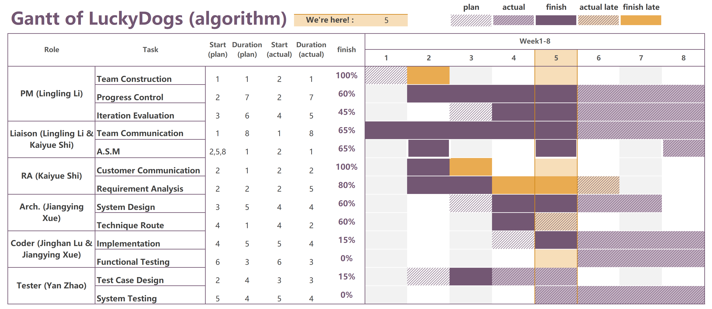

Welcome to LuckyDogs' Pages, this is our project!

# Project Introduction
### Raspberry Pie Based Inteligent Light Control (Client)

# Group Gantt




# Group Introduction
## Team Members

## PM && Liasion：Lingling LI


```
A girl from Hunan 
Like challenging
Contact: 2654585019@qq.com
```

## RA && Liasion：Kaiyue Shi(Kayla）

```
An undergraduate student at Jilin University. 
Enjoy programming and music 
Motto: Hard work makes more influence than cleverness.
Contact: Wechat-18332755168
```

## Coder && Arch：JiangYing Xue

```
Like Disney Movie ##Like sports
Like software projects
Tele: 13096644503
```


## Coder：JingHan Lu

```
Like Maths 
Like basketball 
Interested in game development
Tele:18068272379
```

## Tester：Yan Zhao

```
A patient person who gets along well with others 
Love challenge and pressure
Like coding and algorithmsa
Tele:18844116689
```


## Support or Contact

### address: Software engineering school in Jilin University
